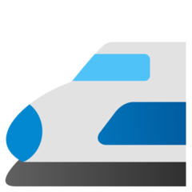

<div id="top"></div>


<!-- PROJECT LOGO -->
<br />
<div align="center">
  <a href="https://github.com/weLoveTrainz/MiniMelbourne">
    
  </a>

  <h3 align="center">MiniMelbourne</h3>

  <p align="center">
    An OSS live train map of Melbourne!
    <br />
    <a href="https://welovetrainz.github.io/MiniMelbourne/">View Demo</a>
    ·
    <a href="https://github.com/weLoveTrainz/MiniMelbourne/issues">Report Bug</a>
</div>


<!-- TABLE OF CONTENTS -->
<details>
  <summary>Table of Contents</summary>
  <ol>
    <li>
      <a href="#about-the-project">About The Project</a>
      <ul>
        <li><a href="#built-with">Built With</a></li>
      </ul>
    </li>
    <li>
      <a href="#getting-started">Getting Started</a>
      <ul>
        <li><a href="#prerequisites">Prerequisites</a></li>
        <li><a href="#installation">Installation</a></li>
      </ul>
    </li>
    <li><a href="#usage">Usage</a></li>
    <li><a href="#roadmap">Roadmap</a></li>
    <li><a href="#contributing">Contributing</a></li>
    <li><a href="#license">License</a></li>
    <li><a href="#contact">Contact</a></li>
    <li><a href="#acknowledgments">Acknowledgments</a></li>
  </ol>
</details>


<!-- ABOUT THE PROJECT -->
## About The Project


A while back, I had found a 3D train map of Tokyo, [called MiniTokyo-3D](https://minitokyo3d.com/) and thought it would be a cool idea to replicate it for Melbourne, seeing as VicRoads had recently exposed an API for querying the live data of train positions. So, during UniHack 2022, me and a team of 4 other people came up with a proof of concept: MiniMelbourne!

Right now, you can search for stations, wander around a 3D Melbourne, and view trains gradually move as their positions update now and then.

<p align="right">(<a href="#top">back to top</a>)</p>


### Built With

* [React.js](https://reactjs.org/)
* [FastAPI](https://fastapi.tiangolo.com/)
* [Mapbox-GL](https://docs.mapbox.com/mapbox-gl-js/api/)
* [deck.gl](https://deck.gl/)


<p align="right">(<a href="#top">back to top</a>)</p>


<!-- GETTING STARTED -->
## Getting Started

If you want to run this locally, clone both the front-end and back-end, then install the required dependencies for both environments. Ideally, set up a virtual environment for the backend, and install the packages locally for the front-end.

### Prerequisites

* npm
  ```sh
  npm install --save
  npm run build
  ```

* backend
    ```sh
    py get_gtfs.py
    py run.py

    ```


<!-- ROADMAP -->
## Roadmap

Lots.
- [ ] Station Card Fixes
    - [ ] Fix station cards that have weird information
    - [ ] Fix misleading to/from city card error
    - [ ] Vehicle ID not showing
    - [ ] Remove extra occupancy information
- [ ] Overlapping lines
    - [ ] Add parallel lines for lines that overlap
    - [ ] Make lines thicker
- [ ] Scaling
    - [ ] Ensure trains scale 
    - [ ] Icons take up too much space
- [ ] Progress Bar for a train
    - [ ] Add a pop-up bar for where a train is along the line
- [ ] Add route search
- [ ] Animation for train moving

<p align="right">(<a href="#top">back to top</a>)</p>


<!-- CONTRIBUTING -->
## Contributing

Contributions are what make the open source community such an amazing place to learn, inspire, and create. Any contributions you make are **greatly appreciated**.

If you have a suggestion that would make this better, please fork the repo and create a pull request. You can also simply open an issue with the tag "enhancement".
Don't forget to give the project a star! Thanks again!

1. Fork the Project
2. Create your Feature Branch (`git checkout -b feature/AmazingFeature`)
3. Commit your Changes (`git commit -m 'Add some AmazingFeature'`)
4. Push to the Branch (`git push origin feature/AmazingFeature`)
5. Open a Pull Request

<p align="right">(<a href="#top">back to top</a>)</p>


<!-- LICENSE -->
## License

Distributed under the MIT License. See `LICENSE.txt` for more information.

<p align="right">(<a href="#top">back to top</a>)</p>


<!-- CONTACT -->
## Contact

Sai kumar Murali krishnan - Email: My name (lower caps, no spaces)<at>gmail<dot>com

Project Link: [https://github.com/weLoveTrainz/MiniMelbourne](https://github.com/weLoveTrainz/MiniMelbournee)

<p align="right">(<a href="#top">back to top</a>)</p>


<!-- ACKNOWLEDGMENTS -->
## Acknowledgments

TBD.


<p align="right">(<a href="#top">back to top</a>)</p>


